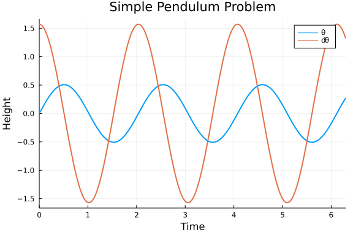
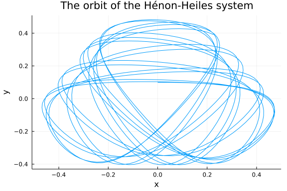

If you're getting some cold feet to jump in to DiffEq land, here are some handcrafted differential equations mini problems to hold your hand along the beginning of your journey.

## First order linear ODE

#### Radioactive Decay of Carbon-14

$$f(t,u) = \frac{du}{dt}$$

The Radioactive decay problem is the first order linear ODE problem of an exponential with a negative coefficient, which represents the half-life of the process in question. Should the coefficient be positive, this would represent a population growth equation.

```julia
using OrdinaryDiffEq, Plots
gr()

#Half-life of Carbon-14 is 5,730 years.
C₁ = 5.730

#Setup
u₀ = 1.0
tspan = (0.0, 1.0)

#Define the problem
radioactivedecay(u,p,t) = -C₁*u

#Pass to solver
prob = ODEProblem(radioactivedecay,u₀,tspan)
sol = solve(prob,Tsit5())

#Plot
plot(sol,linewidth=2,title ="Carbon-14 half-life", xaxis = "Time in thousands of years", yaxis = "Percentage left", label = "Numerical Solution")
plot!(sol.t, t->exp(-C₁*t),lw=3,ls=:dash,label="Analytical Solution")
```


## Second Order Linear ODE

#### Simple Harmonic Oscillator

Another classical example is the harmonic oscillator, given by
$$
\ddot{x} + \omega^2 x = 0
$$
with the known analytical solution
$$
\begin{align*}
x(t) &= A\cos(\omega t - \phi) \\
v(t) &= -A\omega\sin(\omega t - \phi),
\end{align*}
$$
where
$$
A = \sqrt{c_1 + c_2} \qquad\text{and}\qquad \tan \phi = \frac{c_2}{c_1}
$$
with $c_1, c_2$ constants determined by the initial conditions such that
$c_1$ is the initial position and $\omega c_2$ is the initial velocity.

Instead of transforming this to a system of ODEs to solve with `ODEProblem`,
we can use `SecondOrderODEProblem` as follows.

```julia
# Simple Harmonic Oscillator Problem
using OrdinaryDiffEq, Plots

#Parameters
ω = 1

#Initial Conditions
x₀ = [0.0]
dx₀ = [π/2]
tspan = (0.0, 2π)

ϕ = atan((dx₀[1]/ω)/x₀[1])
A = √(x₀[1]^2 + dx₀[1]^2)

#Define the problem
function harmonicoscillator(ddu,du,u,ω,t)
    ddu .= -ω^2 * u
end

#Pass to solvers
prob = SecondOrderODEProblem(harmonicoscillator, dx₀, x₀, tspan, ω)
sol = solve(prob, DPRKN6())

#Plot
plot(sol, vars=[2,1], linewidth=2, title ="Simple Harmonic Oscillator", xaxis = "Time", yaxis = "Elongation", label = ["x" "dx"])
plot!(t->A*cos(ω*t-ϕ), lw=3, ls=:dash, label="Analytical Solution x")
plot!(t->-A*ω*sin(ω*t-ϕ), lw=3, ls=:dash, label="Analytical Solution dx")
```


Note that the order of the variables (and initial conditions) is `dx`, `x`.
Thus, if we want the first series to be `x`, we have to flip the order with `vars=[2,1]`.

## Second Order Non-linear ODE

#### Simple Pendulum

We will start by solving the pendulum problem. In the physics class, we often solve this problem by small angle approximation, i.e. $ sin(\theta) \approx \theta$, because otherwise, we get an elliptic integral which doesn't have an analytic solution. The linearized form is

$$\ddot{\theta} + \frac{g}{L}{\theta} = 0$$

But we have numerical ODE solvers! Why not solve the *real* pendulum?

$$\ddot{\theta} + \frac{g}{L}{\sin(\theta)} = 0$$

Notice that now we have a second order ODE.
In order to use the same method as above, we nee to transform it into a system
of first order ODEs by employing the notation $d\theta = \dot{\theta}$.

$$
\begin{align*}
&\dot{\theta} = d{\theta} \\
&\dot{d\theta} = - \frac{g}{L}{\sin(\theta)}
\end{align*}
$$

```julia
# Simple Pendulum Problem
using OrdinaryDiffEq, Plots

#Constants
const g = 9.81
L = 1.0

#Initial Conditions
u₀ = [0,π/2]
tspan = (0.0,6.3)

#Define the problem
function simplependulum(du,u,p,t)
    θ = u[1]
    dθ = u[2]
    du[1] = dθ
    du[2] = -(g/L)*sin(θ)
end

#Pass to solvers
prob = ODEProblem(simplependulum, u₀, tspan)
sol = solve(prob,Tsit5())

#Plot
plot(sol,linewidth=2,title ="Simple Pendulum Problem", xaxis = "Time", yaxis = "Height", label = ["\\theta" "d\\theta"])
```




So now we know that behaviour of the position versus time. However, it will be useful to us to look at the phase space of the pendulum, i.e., and representation of all possible states of the system in question (the pendulum) by looking at its velocity and position. Phase space analysis is ubiquitous in the analysis of dynamical systems, and thus we will provide a few facilities for it.

```julia
p = plot(sol,vars = (1,2), xlims = (-9,9), title = "Phase Space Plot", xaxis = "Velocity", yaxis = "Position", leg=false)
function phase_plot(prob, u0, p, tspan=2pi)
    _prob = ODEProblem(prob.f,u0,(0.0,tspan))
    sol = solve(_prob,Vern9()) # Use Vern9 solver for higher accuracy
    plot!(p,sol,vars = (1,2), xlims = nothing, ylims = nothing)
end
for i in -4pi:pi/2:4π
    for j in -4pi:pi/2:4π
        phase_plot(prob, [j,i], p)
    end
end
plot(p,xlims = (-9,9))
```


#### Double Pendulum

A more complicated example is given by the double pendulum. The equations governing
its motion are given by the following (taken from this [StackOverflow question](https://mathematica.stackexchange.com/questions/40122/help-to-plot-poincar%C3%A9-section-for-double-pendulum))

$$\frac{d}{dt}
\begin{pmatrix}
\alpha \\ l_\alpha \\ \beta \\ l_\beta
\end{pmatrix}=
\begin{pmatrix}
2\frac{l_\alpha - (1+\cos\beta)l_\beta}{3-\cos 2\beta} \\
-2\sin\alpha - \sin(\alpha + \beta) \\
2\frac{-(1+\cos\beta)l_\alpha + (3+2\cos\beta)l_\beta}{3-\cos2\beta}\\
-\sin(\alpha+\beta) - 2\sin(\beta)\frac{(l_\alpha-l_\beta)l_\beta}{3-\cos2\beta} + 2\sin(2\beta)\frac{l_\alpha^2-2(1+\cos\beta)l_\alpha l_\beta + (3+2\cos\beta)l_\beta^2}{(3-\cos2\beta)^2}
\end{pmatrix}$$

```julia
#Double Pendulum Problem
using OrdinaryDiffEq, Plots

#Constants and setup
const m₁, m₂, L₁, L₂ = 1, 2, 1, 2
initial = [0, π/3, 0, 3pi/5]
tspan = (0.,50.)

#Convenience function for transforming from polar to Cartesian coordinates
function polar2cart(sol;dt=0.02,l1=L₁,l2=L₂,vars=(2,4))
    u = sol.t[1]:dt:sol.t[end]

    p1 = l1*map(x->x[vars[1]], sol.(u))
    p2 = l2*map(y->y[vars[2]], sol.(u))

    x1 = l1*sin.(p1)
    y1 = l1*-cos.(p1)
    (u, (x1 + l2*sin.(p2),
     y1 - l2*cos.(p2)))
end

#Define the Problem
function double_pendulum(xdot,x,p,t)
    xdot[1]=x[2]
    xdot[2]=-((g*(2*m₁+m₂)*sin(x[1])+m₂*(g*sin(x[1]-2*x[3])+2*(L₂*x[4]^2+L₁*x[2]^2*cos(x[1]-x[3]))*sin(x[1]-x[3])))/(2*L₁*(m₁+m₂-m₂*cos(x[1]-x[3])^2)))
    xdot[3]=x[4]
    xdot[4]=(((m₁+m₂)*(L₁*x[2]^2+g*cos(x[1]))+L₂*m₂*x[4]^2*cos(x[1]-x[3]))*sin(x[1]-x[3]))/(L₂*(m₁+m₂-m₂*cos(x[1]-x[3])^2))
end

#Pass to Solvers
double_pendulum_problem = ODEProblem(double_pendulum, initial, tspan)
sol = solve(double_pendulum_problem, Vern7(), abs_tol=1e-10, dt=0.05);
```


```julia
#Obtain coordinates in Cartesian Geometry
ts, ps = polar2cart(sol, l1=L₁, l2=L₂, dt=0.01)
plot(ps...)
```


##### Poincaré section

In this case the phase space is 4 dimensional and it cannot be easily visualized.
Instead of looking at the full phase space, we can look at Poincaré sections,
which are sections through a higher-dimensional phase space diagram.
This helps to understand the dynamics of interactions and is wonderfully pretty.

The Poincaré section in this is given by the collection of $(β,l_β)$ when $α=0$ and $\frac{dα}{dt}>0$.

```julia
#Constants and setup
using OrdinaryDiffEq
initial2 = [0.01, 0.005, 0.01, 0.01]
tspan2 = (0.,500.)

#Define the problem
function double_pendulum_hamiltonian(udot,u,p,t)
    α  = u[1]
    lα = u[2]
    β  = u[3]
    lβ = u[4]
    udot .=
    [2(lα-(1+cos(β))lβ)/(3-cos(2β)),
    -2sin(α) - sin(α+β),
    2(-(1+cos(β))lα + (3+2cos(β))lβ)/(3-cos(2β)),
    -sin(α+β) - 2sin(β)*(((lα-lβ)lβ)/(3-cos(2β))) + 2sin(2β)*((lα^2 - 2(1+cos(β))lα*lβ + (3+2cos(β))lβ^2)/(3-cos(2β))^2)]
end

# Construct a ContiunousCallback
condition(u,t,integrator) = u[1]
affect!(integrator) = nothing
cb = ContinuousCallback(condition,affect!,nothing,
                        save_positions = (true,false))

# Construct Problem
poincare = ODEProblem(double_pendulum_hamiltonian, initial2, tspan2)
sol2 = solve(poincare, Vern9(), save_everystep = false, save_start=false, save_end=false, callback=cb, abstol=1e-16, reltol=1e-16,)

function poincare_map(prob, u₀, p; callback=cb)
    _prob = ODEProblem(prob.f, u₀, prob.tspan)
    sol = solve(_prob, Vern9(), save_everystep = false, save_start=false, save_end=false, callback=cb, abstol=1e-16, reltol=1e-16)
    scatter!(p, sol, vars=(3,4), markersize = 3, msw=0)
end
```

```
poincare_map (generic function with 1 method)
```


```julia
lβrange = -0.02:0.0025:0.02
p = scatter(sol2, vars=(3,4), leg=false, markersize = 3, msw=0)
for lβ in lβrange
    poincare_map(poincare, [0.01, 0.01, 0.01, lβ], p)
end
plot(p, xlabel="\\beta", ylabel="l_\\beta", ylims=(0, 0.03))
```


#### Hénon-Heiles System

The Hénon-Heiles potential occurs when non-linear motion of a star around a galactic center with the motion restricted to a plane.

$$
\begin{align}
\frac{d^2x}{dt^2}&=-\frac{\partial V}{\partial x}\\
\frac{d^2y}{dt^2}&=-\frac{\partial V}{\partial y}
\end{align}
$$

where

$$V(x,y)={\frac {1}{2}}(x^{2}+y^{2})+\lambda \left(x^{2}y-{\frac {y^{3}}{3}}\right).$$

We pick $\lambda=1$ in this case, so

$$V(x,y) = \frac{1}{2}(x^2+y^2+2x^2y-\frac{2}{3}y^3).$$

Then the total energy of the system can be expressed by

$$E = T+V = V(x,y)+\frac{1}{2}(\dot{x}^2+\dot{y}^2).$$

The total energy should conserve as this system evolves.

```julia
using OrdinaryDiffEq, Plots

#Setup
initial = [0.,0.1,0.5,0]
tspan = (0,100.)

#Remember, V is the potential of the system and T is the Total Kinetic Energy, thus E will
#the total energy of the system.
V(x,y) = 1//2 * (x^2 + y^2 + 2x^2*y - 2//3 * y^3)
E(x,y,dx,dy) = V(x,y) + 1//2 * (dx^2 + dy^2);

#Define the function
function Hénon_Heiles(du,u,p,t)
    x  = u[1]
    y  = u[2]
    dx = u[3]
    dy = u[4]
    du[1] = dx
    du[2] = dy
    du[3] = -x - 2x*y
    du[4] = y^2 - y -x^2
end

#Pass to solvers
prob = ODEProblem(Hénon_Heiles, initial, tspan)
sol = solve(prob, Vern9(), abs_tol=1e-16, rel_tol=1e-16);
```


```julia
# Plot the orbit
plot(sol, vars=(1,2), title = "The orbit of the Hénon-Heiles system", xaxis = "x", yaxis = "y", leg=false)
```



```julia
#Optional Sanity check - what do you think this returns and why?
@show sol.retcode

#Plot -
plot(sol, vars=(1,3), title = "Phase space for the Hénon-Heiles system", xaxis = "Position", yaxis = "Velocity")
plot!(sol, vars=(2,4), leg = false)
```

```
sol.retcode = :Success
```


```julia
#We map the Total energies during the time intervals of the solution (sol.u here) to a new vector
#pass it to the plotter a bit more conveniently
energy = map(x->E(x...), sol.u)

#We use @show here to easily spot erratic behaviour in our system by seeing if the loss in energy was too great.
@show ΔE = energy[1]-energy[end]

#Plot
plot(sol.t, energy .- energy[1], title = "Change in Energy over Time", xaxis = "Time in iterations", yaxis = "Change in Energy")
```

```
ΔE = energy[1] - energy[end] = -3.098606125834236e-5
```


##### Symplectic Integration

To prevent energy drift, we can instead use a symplectic integrator. We can directly define and solve the `SecondOrderODEProblem`:

```julia
function HH_acceleration!(dv,v,u,p,t)
    x,y  = u
    dx,dy = dv
    dv[1] = -x - 2x*y
    dv[2] = y^2 - y -x^2
end
initial_positions = [0.0,0.1]
initial_velocities = [0.5,0.0]
prob = SecondOrderODEProblem(HH_acceleration!,initial_velocities,initial_positions,tspan)
sol2 = solve(prob, KahanLi8(), dt=1/10);
```


Notice that we get the same results:

```julia
# Plot the orbit
plot(sol2, vars=(3,4), title = "The orbit of the Hénon-Heiles system", xaxis = "x", yaxis = "y", leg=false)
```


```julia
plot(sol2, vars=(3,1), title = "Phase space for the Hénon-Heiles system", xaxis = "Position", yaxis = "Velocity")
plot!(sol2, vars=(4,2), leg = false)
```


but now the energy change is essentially zero:

```julia
energy = map(x->E(x[3], x[4], x[1], x[2]), sol2.u)
#We use @show here to easily spot erratic behaviour in our system by seeing if the loss in energy was too great.
@show ΔE = energy[1]-energy[end]

#Plot
plot(sol2.t, energy .- energy[1], title = "Change in Energy over Time", xaxis = "Time in iterations", yaxis = "Change in Energy")
```

```
ΔE = energy[1] - energy[end] = 9.048317650695026e-15
```


And let's try to use a Runge-Kutta-Nyström solver to solve this. Note that Runge-Kutta-Nyström isn't symplectic.

```julia
sol3 = solve(prob, DPRKN6());
energy = map(x->E(x[3], x[4], x[1], x[2]), sol3.u)
@show ΔE = energy[1]-energy[end]
gr()
plot(sol3.t, energy .- energy[1], title = "Change in Energy over Time", xaxis = "Time in iterations", yaxis = "Change in Energy")
```

```
ΔE = energy[1] - energy[end] = -2.723253093667166e-6
```


Note that we are using the `DPRKN6` sovler at `reltol=1e-3` (the default), yet it has a smaller energy variation than `Vern9` at `abs_tol=1e-16, rel_tol=1e-16`. Therefore, using specialized solvers to solve its particular problem is very efficient.


## Appendix

These tutorials are a part of the SciMLTutorials.jl repository, found at: [https://github.com/SciML/SciMLTutorials.jl](https://github.com/SciML/SciMLTutorials.jl). For more information on high-performance scientific machine learning, check out the SciML Open Source Software Organization [https://sciml.ai](https://sciml.ai).

To locally run this tutorial, do the following commands:

```
using SciMLTutorials
SciMLTutorials.weave_file("tutorials/models","01-classical_physics.jmd")
```

Computer Information:

```
Julia Version 1.6.2
Commit 1b93d53fc4 (2021-07-14 15:36 UTC)
Platform Info:
  OS: Linux (x86_64-pc-linux-gnu)
  CPU: AMD EPYC 7502 32-Core Processor
  WORD_SIZE: 64
  LIBM: libopenlibm
  LLVM: libLLVM-11.0.1 (ORCJIT, znver2)
Environment:
  JULIA_DEPOT_PATH = /root/.cache/julia-buildkite-plugin/depots/a6029d3a-f78b-41ea-bc97-28aa57c6c6ea
  JULIA_NUM_THREADS = 16

```

Package Information:

```
      Status `/var/lib/buildkite-agent/builds/7-amdci4-julia-csail-mit-edu/julialang/scimltutorials-dot-jl/tutorials/models/Project.toml`
  [479239e8] Catalyst v6.12.1
  [459566f4] DiffEqCallbacks v2.16.1
  [f3b72e0c] DiffEqDevTools v2.27.2
  [055956cb] DiffEqPhysics v3.9.0
  [0c46a032] DifferentialEquations v6.17.1
  [31c24e10] Distributions v0.24.18
  [587475ba] Flux v0.12.1
  [f6369f11] ForwardDiff v0.10.18
  [23fbe1c1] Latexify v0.15.5
  [961ee093] ModelingToolkit v5.17.3
  [2774e3e8] NLsolve v4.5.1
  [315f7962] NeuralPDE v3.10.1
  [429524aa] Optim v1.3.0
  [1dea7af3] OrdinaryDiffEq v5.56.0
  [91a5bcdd] Plots v1.15.2
  [731186ca] RecursiveArrayTools v2.11.4
  [30cb0354] SciMLTutorials v0.9.0
  [789caeaf] StochasticDiffEq v6.34.1
  [37e2e46d] LinearAlgebra
  [2f01184e] SparseArrays
```

And the full manifest:

```
      Status `/var/lib/buildkite-agent/builds/7-amdci4-julia-csail-mit-edu/julialang/scimltutorials-dot-jl/tutorials/models/Manifest.toml`
  [c3fe647b] AbstractAlgebra v0.16.0
  [621f4979] AbstractFFTs v1.0.1
  [1520ce14] AbstractTrees v0.3.4
  [79e6a3ab] Adapt v3.3.0
  [ec485272] ArnoldiMethod v0.1.0
  [4fba245c] ArrayInterface v3.1.15
  [4c555306] ArrayLayouts v0.7.0
  [13072b0f] AxisAlgorithms v1.0.0
  [ab4f0b2a] BFloat16s v0.1.0
  [aae01518] BandedMatrices v0.16.9
  [764a87c0] BoundaryValueDiffEq v2.7.1
  [fa961155] CEnum v0.4.1
  [00ebfdb7] CSTParser v2.5.0
  [052768ef] CUDA v2.6.3
  [479239e8] Catalyst v6.12.1
  [082447d4] ChainRules v0.7.65
  [d360d2e6] ChainRulesCore v0.9.44
  [b630d9fa] CheapThreads v0.2.5
  [944b1d66] CodecZlib v0.7.0
  [35d6a980] ColorSchemes v3.12.1
  [3da002f7] ColorTypes v0.11.0
  [5ae59095] Colors v0.12.8
  [861a8166] Combinatorics v1.0.2
  [a80b9123] CommonMark v0.8.1
  [38540f10] CommonSolve v0.2.0
  [bbf7d656] CommonSubexpressions v0.3.0
  [34da2185] Compat v3.30.0
  [8f4d0f93] Conda v1.5.2
  [88cd18e8] ConsoleProgressMonitor v0.1.2
  [187b0558] ConstructionBase v1.2.1
  [d38c429a] Contour v0.5.7
  [a8cc5b0e] Crayons v4.0.4
  [8a292aeb] Cuba v2.2.0
  [667455a9] Cubature v1.5.1
  [9a962f9c] DataAPI v1.6.0
  [82cc6244] DataInterpolations v3.3.1
  [864edb3b] DataStructures v0.18.9
  [e2d170a0] DataValueInterfaces v1.0.0
  [bcd4f6db] DelayDiffEq v5.31.0
  [2b5f629d] DiffEqBase v6.62.2
  [459566f4] DiffEqCallbacks v2.16.1
  [f3b72e0c] DiffEqDevTools v2.27.2
  [5a0ffddc] DiffEqFinancial v2.4.0
  [aae7a2af] DiffEqFlux v1.37.0
  [c894b116] DiffEqJump v6.14.2
  [77a26b50] DiffEqNoiseProcess v5.7.3
  [055956cb] DiffEqPhysics v3.9.0
  [41bf760c] DiffEqSensitivity v6.45.0
  [163ba53b] DiffResults v1.0.3
  [b552c78f] DiffRules v1.0.2
  [0c46a032] DifferentialEquations v6.17.1
  [c619ae07] DimensionalPlotRecipes v1.2.0
  [b4f34e82] Distances v0.10.3
  [31c24e10] Distributions v0.24.18
  [ced4e74d] DistributionsAD v0.6.26
  [ffbed154] DocStringExtensions v0.8.4
  [e30172f5] Documenter v0.26.3
  [d4d017d3] ExponentialUtilities v1.8.4
  [e2ba6199] ExprTools v0.1.3
  [c87230d0] FFMPEG v0.4.0
  [7a1cc6ca] FFTW v1.4.1
  [7034ab61] FastBroadcast v0.1.8
  [9aa1b823] FastClosures v0.3.2
  [1a297f60] FillArrays v0.11.7
  [6a86dc24] FiniteDiff v2.8.0
  [53c48c17] FixedPointNumbers v0.8.4
  [587475ba] Flux v0.12.1
  [59287772] Formatting v0.4.2
  [f6369f11] ForwardDiff v0.10.18
  [069b7b12] FunctionWrappers v1.1.2
  [d9f16b24] Functors v0.2.1
  [0c68f7d7] GPUArrays v6.4.1
  [61eb1bfa] GPUCompiler v0.10.0
  [28b8d3ca] GR v0.57.4
  [a75be94c] GalacticOptim v1.2.0
  [5c1252a2] GeometryBasics v0.3.12
  [af5da776] GlobalSensitivity v1.0.0
  [42e2da0e] Grisu v1.0.2
  [19dc6840] HCubature v1.5.0
  [cd3eb016] HTTP v0.9.9
  [eafb193a] Highlights v0.4.5
  [0e44f5e4] Hwloc v2.0.0
  [7073ff75] IJulia v1.23.2
  [b5f81e59] IOCapture v0.1.1
  [7869d1d1] IRTools v0.4.2
  [615f187c] IfElse v0.1.0
  [d25df0c9] Inflate v0.1.2
  [83e8ac13] IniFile v0.5.0
  [a98d9a8b] Interpolations v0.13.2
  [c8e1da08] IterTools v1.3.0
  [42fd0dbc] IterativeSolvers v0.9.1
  [82899510] IteratorInterfaceExtensions v1.0.0
  [692b3bcd] JLLWrappers v1.3.0
  [682c06a0] JSON v0.21.1
  [98e50ef6] JuliaFormatter v0.13.7
  [e5e0dc1b] Juno v0.8.4
  [5ab0869b] KernelDensity v0.6.3
  [929cbde3] LLVM v3.7.1
  [b964fa9f] LaTeXStrings v1.2.1
  [2ee39098] LabelledArrays v1.6.1
  [23fbe1c1] Latexify v0.15.5
  [a5e1c1ea] LatinHypercubeSampling v1.8.0
  [73f95e8e] LatticeRules v0.0.1
  [1d6d02ad] LeftChildRightSiblingTrees v0.1.2
  [093fc24a] LightGraphs v1.3.5
  [d3d80556] LineSearches v7.1.1
  [2ab3a3ac] LogExpFunctions v0.2.4
  [e6f89c97] LoggingExtras v0.4.6
  [bdcacae8] LoopVectorization v0.12.23
  [1914dd2f] MacroTools v0.5.6
  [739be429] MbedTLS v1.0.3
  [442fdcdd] Measures v0.3.1
  [e89f7d12] Media v0.5.0
  [c03570c3] Memoize v0.4.4
  [e1d29d7a] Missings v1.0.0
  [961ee093] ModelingToolkit v5.17.3
  [4886b29c] MonteCarloIntegration v0.0.2
  [46d2c3a1] MuladdMacro v0.2.2
  [f9640e96] MultiScaleArrays v1.8.1
  [ffc61752] Mustache v1.0.10
  [d41bc354] NLSolversBase v7.8.0
  [2774e3e8] NLsolve v4.5.1
  [872c559c] NNlib v0.7.19
  [77ba4419] NaNMath v0.3.5
  [315f7962] NeuralPDE v3.10.1
  [8913a72c] NonlinearSolve v0.3.8
  [6fe1bfb0] OffsetArrays v1.9.0
  [429524aa] Optim v1.3.0
  [bac558e1] OrderedCollections v1.4.1
  [1dea7af3] OrdinaryDiffEq v5.56.0
  [90014a1f] PDMats v0.11.0
  [65888b18] ParameterizedFunctions v5.10.0
  [d96e819e] Parameters v0.12.2
  [69de0a69] Parsers v1.1.0
  [ccf2f8ad] PlotThemes v2.0.1
  [995b91a9] PlotUtils v1.0.10
  [91a5bcdd] Plots v1.15.2
  [e409e4f3] PoissonRandom v0.4.0
  [f517fe37] Polyester v0.3.1
  [85a6dd25] PositiveFactorizations v0.2.4
  [21216c6a] Preferences v1.2.2
  [33c8b6b6] ProgressLogging v0.1.4
  [92933f4c] ProgressMeter v1.6.2
  [1fd47b50] QuadGK v2.4.1
  [67601950] Quadrature v1.8.1
  [8a4e6c94] QuasiMonteCarlo v0.2.2
  [74087812] Random123 v1.3.1
  [fb686558] RandomExtensions v0.4.3
  [e6cf234a] RandomNumbers v1.4.0
  [c84ed2f1] Ratios v0.4.0
  [3cdcf5f2] RecipesBase v1.1.1
  [01d81517] RecipesPipeline v0.3.2
  [731186ca] RecursiveArrayTools v2.11.4
  [f2c3362d] RecursiveFactorization v0.1.12
  [189a3867] Reexport v1.0.0
  [ae029012] Requires v1.1.3
  [ae5879a3] ResettableStacks v1.1.0
  [37e2e3b7] ReverseDiff v1.9.0
  [79098fc4] Rmath v0.7.0
  [47965b36] RootedTrees v1.0.0
  [7e49a35a] RuntimeGeneratedFunctions v0.5.2
  [476501e8] SLEEFPirates v0.6.20
  [1bc83da4] SafeTestsets v0.0.1
  [0bca4576] SciMLBase v1.13.4
  [30cb0354] SciMLTutorials v0.9.0
  [6c6a2e73] Scratch v1.0.3
  [efcf1570] Setfield v0.7.0
  [992d4aef] Showoff v1.0.3
  [699a6c99] SimpleTraits v0.9.3
  [ed01d8cd] Sobol v1.5.0
  [b85f4697] SoftGlobalScope v1.1.0
  [a2af1166] SortingAlgorithms v1.0.0
  [47a9eef4] SparseDiffTools v1.13.2
  [276daf66] SpecialFunctions v1.4.1
  [860ef19b] StableRNGs v1.0.0
  [aedffcd0] Static v0.2.4
  [90137ffa] StaticArrays v1.2.0
  [82ae8749] StatsAPI v1.0.0
  [2913bbd2] StatsBase v0.33.8
  [4c63d2b9] StatsFuns v0.9.8
  [9672c7b4] SteadyStateDiffEq v1.6.2
  [789caeaf] StochasticDiffEq v6.34.1
  [7792a7ef] StrideArraysCore v0.1.11
  [09ab397b] StructArrays v0.5.1
  [c3572dad] Sundials v4.4.3
  [d1185830] SymbolicUtils v0.11.2
  [0c5d862f] Symbolics v0.1.25
  [3783bdb8] TableTraits v1.0.1
  [bd369af6] Tables v1.4.2
  [5d786b92] TerminalLoggers v0.1.3
  [8290d209] ThreadingUtilities v0.4.4
  [a759f4b9] TimerOutputs v0.5.9
  [0796e94c] Tokenize v0.5.16
  [9f7883ad] Tracker v0.2.16
  [3bb67fe8] TranscodingStreams v0.9.5
  [592b5752] Trapz v2.0.2
  [a2a6695c] TreeViews v0.3.0
  [5c2747f8] URIs v1.3.0
  [3a884ed6] UnPack v1.0.2
  [1986cc42] Unitful v1.7.0
  [3d5dd08c] VectorizationBase v0.20.11
  [81def892] VersionParsing v1.2.0
  [19fa3120] VertexSafeGraphs v0.1.2
  [44d3d7a6] Weave v0.10.8
  [efce3f68] WoodburyMatrices v0.5.3
  [ddb6d928] YAML v0.4.6
  [c2297ded] ZMQ v1.2.1
  [a5390f91] ZipFile v0.9.3
  [e88e6eb3] Zygote v0.6.11
  [700de1a5] ZygoteRules v0.2.1
  [6e34b625] Bzip2_jll v1.0.6+5
  [83423d85] Cairo_jll v1.16.0+6
  [3bed1096] Cuba_jll v4.2.1+0
  [7bc98958] Cubature_jll v1.0.4+0
  [5ae413db] EarCut_jll v2.1.5+1
  [2e619515] Expat_jll v2.2.10+0
  [b22a6f82] FFMPEG_jll v4.3.1+4
  [f5851436] FFTW_jll v3.3.9+7
  [a3f928ae] Fontconfig_jll v2.13.1+14
  [d7e528f0] FreeType2_jll v2.10.1+5
  [559328eb] FriBidi_jll v1.0.5+6
  [0656b61e] GLFW_jll v3.3.4+0
  [d2c73de3] GR_jll v0.57.2+0
  [78b55507] Gettext_jll v0.21.0+0
  [7746bdde] Glib_jll v2.68.1+0
  [e33a78d0] Hwloc_jll v2.4.1+0
  [1d5cc7b8] IntelOpenMP_jll v2018.0.3+2
  [aacddb02] JpegTurbo_jll v2.0.1+3
  [c1c5ebd0] LAME_jll v3.100.0+3
  [dd4b983a] LZO_jll v2.10.1+0
  [dd192d2f] LibVPX_jll v1.9.0+1
  [e9f186c6] Libffi_jll v3.2.2+0
  [d4300ac3] Libgcrypt_jll v1.8.7+0
  [7e76a0d4] Libglvnd_jll v1.3.0+3
  [7add5ba3] Libgpg_error_jll v1.42.0+0
  [94ce4f54] Libiconv_jll v1.16.1+0
  [4b2f31a3] Libmount_jll v2.35.0+0
  [89763e89] Libtiff_jll v4.1.0+2
  [38a345b3] Libuuid_jll v2.36.0+0
  [856f044c] MKL_jll v2021.1.1+1
  [e7412a2a] Ogg_jll v1.3.4+2
  [458c3c95] OpenSSL_jll v1.1.1+6
  [efe28fd5] OpenSpecFun_jll v0.5.4+0
  [91d4177d] Opus_jll v1.3.1+3
  [2f80f16e] PCRE_jll v8.44.0+0
  [30392449] Pixman_jll v0.40.1+0
  [ea2cea3b] Qt5Base_jll v5.15.2+0
  [f50d1b31] Rmath_jll v0.3.0+0
  [fb77eaff] Sundials_jll v5.2.0+1
  [a2964d1f] Wayland_jll v1.17.0+4
  [2381bf8a] Wayland_protocols_jll v1.18.0+4
  [02c8fc9c] XML2_jll v2.9.12+0
  [aed1982a] XSLT_jll v1.1.34+0
  [4f6342f7] Xorg_libX11_jll v1.6.9+4
  [0c0b7dd1] Xorg_libXau_jll v1.0.9+4
  [935fb764] Xorg_libXcursor_jll v1.2.0+4
  [a3789734] Xorg_libXdmcp_jll v1.1.3+4
  [1082639a] Xorg_libXext_jll v1.3.4+4
  [d091e8ba] Xorg_libXfixes_jll v5.0.3+4
  [a51aa0fd] Xorg_libXi_jll v1.7.10+4
  [d1454406] Xorg_libXinerama_jll v1.1.4+4
  [ec84b674] Xorg_libXrandr_jll v1.5.2+4
  [ea2f1a96] Xorg_libXrender_jll v0.9.10+4
  [14d82f49] Xorg_libpthread_stubs_jll v0.1.0+3
  [c7cfdc94] Xorg_libxcb_jll v1.13.0+3
  [cc61e674] Xorg_libxkbfile_jll v1.1.0+4
  [12413925] Xorg_xcb_util_image_jll v0.4.0+1
  [2def613f] Xorg_xcb_util_jll v0.4.0+1
  [975044d2] Xorg_xcb_util_keysyms_jll v0.4.0+1
  [0d47668e] Xorg_xcb_util_renderutil_jll v0.3.9+1
  [c22f9ab0] Xorg_xcb_util_wm_jll v0.4.1+1
  [35661453] Xorg_xkbcomp_jll v1.4.2+4
  [33bec58e] Xorg_xkeyboard_config_jll v2.27.0+4
  [c5fb5394] Xorg_xtrans_jll v1.4.0+3
  [8f1865be] ZeroMQ_jll v4.3.2+6
  [3161d3a3] Zstd_jll v1.5.0+0
  [0ac62f75] libass_jll v0.14.0+4
  [f638f0a6] libfdk_aac_jll v0.1.6+4
  [b53b4c65] libpng_jll v1.6.38+0
  [a9144af2] libsodium_jll v1.0.20+0
  [f27f6e37] libvorbis_jll v1.3.6+6
  [1270edf5] x264_jll v2020.7.14+2
  [dfaa095f] x265_jll v3.0.0+3
  [d8fb68d0] xkbcommon_jll v0.9.1+5
  [0dad84c5] ArgTools
  [56f22d72] Artifacts
  [2a0f44e3] Base64
  [ade2ca70] Dates
  [8bb1440f] DelimitedFiles
  [8ba89e20] Distributed
  [f43a241f] Downloads
  [7b1f6079] FileWatching
  [9fa8497b] Future
  [b77e0a4c] InteractiveUtils
  [4af54fe1] LazyArtifacts
  [b27032c2] LibCURL
  [76f85450] LibGit2
  [8f399da3] Libdl
  [37e2e46d] LinearAlgebra
  [56ddb016] Logging
  [d6f4376e] Markdown
  [a63ad114] Mmap
  [ca575930] NetworkOptions
  [44cfe95a] Pkg
  [de0858da] Printf
  [9abbd945] Profile
  [3fa0cd96] REPL
  [9a3f8284] Random
  [ea8e919c] SHA
  [9e88b42a] Serialization
  [1a1011a3] SharedArrays
  [6462fe0b] Sockets
  [2f01184e] SparseArrays
  [10745b16] Statistics
  [4607b0f0] SuiteSparse
  [fa267f1f] TOML
  [a4e569a6] Tar
  [8dfed614] Test
  [cf7118a7] UUIDs
  [4ec0a83e] Unicode
  [e66e0078] CompilerSupportLibraries_jll
  [deac9b47] LibCURL_jll
  [29816b5a] LibSSH2_jll
  [c8ffd9c3] MbedTLS_jll
  [14a3606d] MozillaCACerts_jll
  [4536629a] OpenBLAS_jll
  [bea87d4a] SuiteSparse_jll
  [83775a58] Zlib_jll
  [8e850ede] nghttp2_jll
  [3f19e933] p7zip_jll
```

