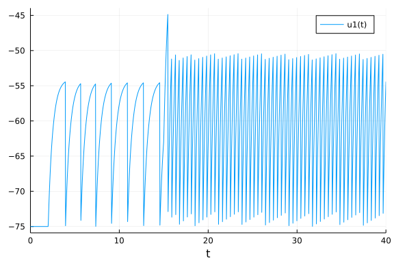
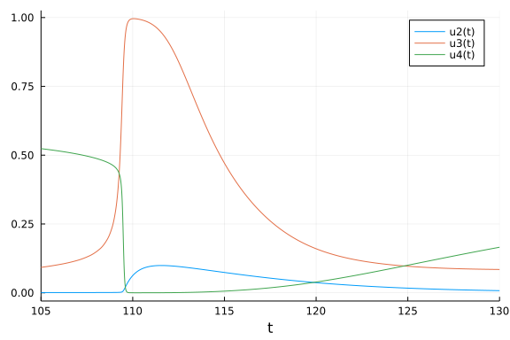
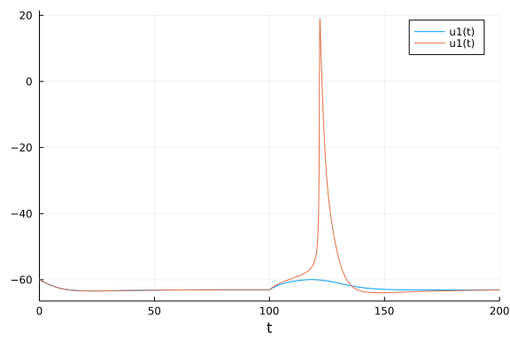
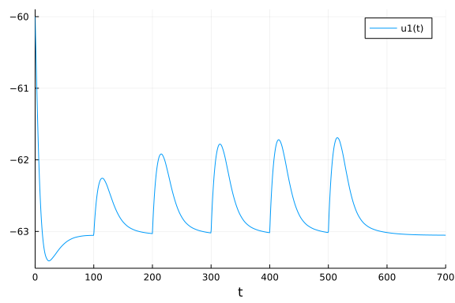
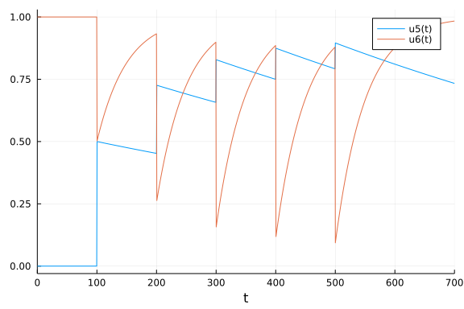
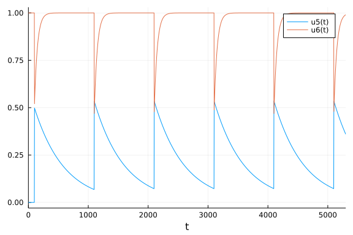

This is an introduction to spiking neural systems with Julia's DifferentialEquations package.
We will cover three different models: leaky integrate-and-fire, Izhikevich, and Hodgkin-Huxley.
Finally we will also learn about two mechanisms that simulate synaptic inputs like
real neurons receive them. The alpha synapse and the Tsodyks-Markram synapse. Let's get started
with the leaky integrate-and-fire (LIF) model.
## The Leaky Integrate-and-Fire Model
The LIF model is an extension of the integrate-and-fire (IF) model. While the IF
model simply integrates input until it fires, the LIF model integrates input but
also decays towards an equilibrium potential. This means that inputs that arrive
in quick succession have a much higher chance to make the cell spike as opposed
to inputs that are further apart in time. The LIF is a more realistic neuron
model than the IF, because it is known from real neurons that the timing of
inputs is extremely relevant for their spiking.

The LIF model has five parameters, `gL, EL, C, Vth, I` and we define it in the `lif(u, p, t)` function.

```julia
using DifferentialEquations
using Plots
gr()

function lif(u,p,t);
    gL, EL, C, Vth, I = p
    (-gL*(u-EL)+I)/C
end
```

```
lif (generic function with 1 method)
```


Our system is described by one differential equation: `(-gL*(u-EL)+I)/C`, where
`u` is the voltage, `I` is the input, `gL` is the leak conductance, `EL` is the
equilibrium potential of the leak conductance and `C` is the membrane capacitance.
Generally, any change of the voltage is slowed down (filtered) by the membrane
capacitance. That's why we divide the whole equation by `C`. Without any external
input, the voltage always converges towards `EL`. If `u` is larger than `EL`,
`u` decreases until it is at `EL`. If `u` is smaller than `EL`, `u` increases
until it is at `EL`. The only other thing that can change the voltage is the
external input `I`.

Our `lif` function requires a certain parameter structure because it will need
to be compatible with the `DifferentialEquations` interface. The input signature
is `lif(u, p, t)` where `u` is the voltage, `p` is the collection of the parameters
that describe the equation and `t` is time. You might wonder why time does not
show up in our equation, although we need to calculate the change in voltage
with respect to time. The ODE solver will take care of time for us. One of
the advantages of the ODE solver as opposed to calculating the change of
`u` in a for loop is that many ODE solver algorithms can dynamically adjust the
time step in a way that is efficient and accurate.

One crucial thing is still missing however. This is supposed to be a model of
neural spiking, right? So we need a mechanism that recognizes the spike and
hyperpolarizes `u` in response. For this purpose we will use callbacks.
They can make discontinuous changes to the model when certain conditions are met.

```julia
function thr(u,t,integrator)
    integrator.u > integrator.p[4]
end

function reset!(integrator)
    integrator.u = integrator.p[2]
end

threshold = DiscreteCallback(thr,reset!)
current_step= PresetTimeCallback([2,15],integrator -> integrator.p[5] += 210.0)
cb = CallbackSet(current_step,threshold)
```

```
SciMLBase.CallbackSet{Tuple{}, Tuple{SciMLBase.DiscreteCallback{DiffEqCallb
acks.var"#60#63"{Vector{Int64}}, DiffEqCallbacks.var"#61#64"{Main.var"##Wea
veSandBox#2411".var"#1#2"}, DiffEqCallbacks.var"#62#65"{typeof(SciMLBase.IN
ITIALIZE_DEFAULT), Bool, Vector{Int64}, Main.var"##WeaveSandBox#2411".var"#
1#2"}, typeof(SciMLBase.FINALIZE_DEFAULT)}, SciMLBase.DiscreteCallback{type
of(Main.var"##WeaveSandBox#2411".thr), typeof(Main.var"##WeaveSandBox#2411"
.reset!), typeof(SciMLBase.INITIALIZE_DEFAULT), typeof(SciMLBase.FINALIZE_D
EFAULT)}}}((), (SciMLBase.DiscreteCallback{DiffEqCallbacks.var"#60#63"{Vect
or{Int64}}, DiffEqCallbacks.var"#61#64"{Main.var"##WeaveSandBox#2411".var"#
1#2"}, DiffEqCallbacks.var"#62#65"{typeof(SciMLBase.INITIALIZE_DEFAULT), Bo
ol, Vector{Int64}, Main.var"##WeaveSandBox#2411".var"#1#2"}, typeof(SciMLBa
se.FINALIZE_DEFAULT)}(DiffEqCallbacks.var"#60#63"{Vector{Int64}}([2, 15]), 
DiffEqCallbacks.var"#61#64"{Main.var"##WeaveSandBox#2411".var"#1#2"}(Main.v
ar"##WeaveSandBox#2411".var"#1#2"()), DiffEqCallbacks.var"#62#65"{typeof(Sc
iMLBase.INITIALIZE_DEFAULT), Bool, Vector{Int64}, Main.var"##WeaveSandBox#2
411".var"#1#2"}(SciMLBase.INITIALIZE_DEFAULT, true, [2, 15], Main.var"##Wea
veSandBox#2411".var"#1#2"()), SciMLBase.FINALIZE_DEFAULT, Bool[1, 1]), SciM
LBase.DiscreteCallback{typeof(Main.var"##WeaveSandBox#2411".thr), typeof(Ma
in.var"##WeaveSandBox#2411".reset!), typeof(SciMLBase.INITIALIZE_DEFAULT), 
typeof(SciMLBase.FINALIZE_DEFAULT)}(Main.var"##WeaveSandBox#2411".thr, Main
.var"##WeaveSandBox#2411".reset!, SciMLBase.INITIALIZE_DEFAULT, SciMLBase.F
INALIZE_DEFAULT, Bool[1, 1])))
```


Our condition is `thr(u,t,integrator)` and the condition kicks in when `integrator.u > integrator.p[4]` where `p[4]` is our threshold parameter `Vth`. Our effect of the condition is `reset!(integrator)`. It sets `u` back to the equilibrium potential `p[2]`. We then wrap both the condition and the effect into a `DiscreteCallback` called threshold. There is one more callback called `PresetTimeCallback` that is particularly useful. This one increases the input `p[5]` at `t=2` and `t=15` by `210.0`. Both callbacks are then combined into a `CallbackSet`. We are almost done to simulate our system we just need to put numbers on our initial voltage and parameters.

```julia
u0 = -75
tspan = (0.0, 40.0)
# p = (gL, EL, C, Vth, I)
p = [10.0, -75.0, 5.0, -55.0, 0]

prob = ODEProblem(lif, u0, tspan, p, callback=cb)
```

```
ODEProblem with uType Int64 and tType Float64. In-place: false
timespan: (0.0, 40.0)
u0: -75
```


Our initial voltage is `u0 = - 75`, which will be the same as our equilibrium potential, so we start at a stable point. Then we define the timespan we want to simulate. The time scale of the LIF as it is defined conforms roughly to milliseconds. Then we define our parameters as `p = [10.0, -75.0, 5.0, -55.0, 0]`. Remember that `gL, EL, C, Vth, I = p`. Finally we wrap everything into a call to `ODEProblem`. Can't forget the `CallbackSet`. With that our model is defined. Now we just need to solve it with a quick call to `solve`.

```julia
sol = solve(prob)
```

```
retcode: Success
Interpolation: specialized 4th order "free" interpolation, specialized 2nd 
order "free" stiffness-aware interpolation
t: 153-element Vector{Float64}:
  0.0
  9.999999999999999e-5
  0.0010999999999999998
  0.011099999999999997
  0.11109999999999996
  1.1110999999999995
  2.0
  2.0
  2.6300346520855156
  2.922604932362957
  ⋮
 38.34157807913922
 38.78215044450299
 38.78215044450299
 39.22272279235999
 39.22272279235999
 39.663295181066125
 39.663295181066125
 40.0
 40.0
u: 153-element Vector{Float64}:
 -75.0
 -75.0
 -75.0
 -75.0
 -75.0
 -75.0
 -75.0
 -75.0
 -59.978080290282385
 -57.329991819757744
   ⋮
 -75.0
 -50.40489536606269
 -75.0
 -50.40489597428093
 -75.0
 -50.40489455510494
 -75.0
 -54.419257979386686
 -75.0
```


First of all the `solve` output tells us if solving the system generally worked. In this case we know it worked because the return code (`retcode`) says `Success`. Then we get the numbers for the timestep and the solution to `u`. The raw numbers are not super interesting to let's plot our solution.

```julia
plot(sol)
```




We see that the model is resting at `-75` while there is no input. At `t=2` the input increases by `210` and the model starts to spike. Spiking does not start immediately because the input first has to charge the membrane capacitance. Notice how once spiking starts it very quickly becomes extremely regular. Increasing the input again at `t=15` increases firing as we would expect but it is still extremely regular. This is one of the features of the LIF. The firing frequency is regular for constant input and a linear function of the input strength. There are ways to make LIF models less regular. For example we could use certain noise types at the input. We could also simulate a large number of LIF models and connect them synaptically. Instead of going into those topics, we will move on to the Izhikevich model, which is known for its ability to generate a large variety of spiking dynamics during constant inputs.

## The Izhikevich Model
[The Izhikevich model](https://www.izhikevich.org/publications/spikes.htm) is a two-dimensional model of neuronal spiking. It was derived from a bifurcation analysis of a cortical neuron. Because it is two-dimensional it can generate much more complex spike dynamics than the LIF model. The kind of dynamics depend on the four parameters and the input `a, b, c, d, I = p`. All the concepts are the same as above, expect for some minor changes to our function definitions to accomodate for the second dimension.

```julia
#Izhikevichch Model
using DifferentialEquations
using Plots

function izh!(du,u,p,t);
    a, b, c, d, I = p

    du[1] = 0.04*u[1]^2+5*u[1]+140-u[2]+I
    du[2] = a*(b*u[1]-u[2])
end
```

```
izh! (generic function with 1 method)
```


This is our Izhikevich model. There are two important changes here. First of all, note the additional input parameter `du`. This is a sequence of differences. `du[1]` corresponds to the voltage (the first dimension of the system) and `du[2]` corresponds to the second dimension. This second dimension is called `u` in the original Izhikevich work amnd it makes the notation a little annoying. In this tutorial I will generally stick to Julia and `DifferentialEquations` conventions as opposed to conventions of the specific models and `du` is commonly used. We will never define `du` ourselves outside of the function but the ODE solver will use it internally. The other change here is the `!` after our function name. This signifies that `du` will be preallocated before integration and then updated in-place, which saves a lot of allocation time. Now we just need our callbacks to take care of spikes and increase the input.

```julia
function thr(u,t,integrator)
    integrator.u[1] >= 30
end

function reset!(integrator)
    integrator.u[1] = integrator.p[3]
    integrator.u[2] += integrator.p[4]
end

threshold = DiscreteCallback(thr,reset!)
current_step= PresetTimeCallback(50,integrator -> integrator.p[5] += 10)
cb = CallbackSet(current_step,threshold)
```

```
SciMLBase.CallbackSet{Tuple{}, Tuple{SciMLBase.DiscreteCallback{DiffEqCallb
acks.var"#60#63"{Int64}, DiffEqCallbacks.var"#61#64"{Main.var"##WeaveSandBo
x#2411".var"#3#4"}, DiffEqCallbacks.var"#62#65"{typeof(SciMLBase.INITIALIZE
_DEFAULT), Bool, Int64, Main.var"##WeaveSandBox#2411".var"#3#4"}, typeof(Sc
iMLBase.FINALIZE_DEFAULT)}, SciMLBase.DiscreteCallback{typeof(Main.var"##We
aveSandBox#2411".thr), typeof(Main.var"##WeaveSandBox#2411".reset!), typeof
(SciMLBase.INITIALIZE_DEFAULT), typeof(SciMLBase.FINALIZE_DEFAULT)}}}((), (
SciMLBase.DiscreteCallback{DiffEqCallbacks.var"#60#63"{Int64}, DiffEqCallba
cks.var"#61#64"{Main.var"##WeaveSandBox#2411".var"#3#4"}, DiffEqCallbacks.v
ar"#62#65"{typeof(SciMLBase.INITIALIZE_DEFAULT), Bool, Int64, Main.var"##We
aveSandBox#2411".var"#3#4"}, typeof(SciMLBase.FINALIZE_DEFAULT)}(DiffEqCall
backs.var"#60#63"{Int64}(50), DiffEqCallbacks.var"#61#64"{Main.var"##WeaveS
andBox#2411".var"#3#4"}(Main.var"##WeaveSandBox#2411".var"#3#4"()), DiffEqC
allbacks.var"#62#65"{typeof(SciMLBase.INITIALIZE_DEFAULT), Bool, Int64, Mai
n.var"##WeaveSandBox#2411".var"#3#4"}(SciMLBase.INITIALIZE_DEFAULT, true, 5
0, Main.var"##WeaveSandBox#2411".var"#3#4"()), SciMLBase.FINALIZE_DEFAULT, 
Bool[1, 1]), SciMLBase.DiscreteCallback{typeof(Main.var"##WeaveSandBox#2411
".thr), typeof(Main.var"##WeaveSandBox#2411".reset!), typeof(SciMLBase.INIT
IALIZE_DEFAULT), typeof(SciMLBase.FINALIZE_DEFAULT)}(Main.var"##WeaveSandBo
x#2411".thr, Main.var"##WeaveSandBox#2411".reset!, SciMLBase.INITIALIZE_DEF
AULT, SciMLBase.FINALIZE_DEFAULT, Bool[1, 1])))
```


One key feature of the Izhikevich model is that each spike increases our second dimension `u[2]` by a preset amount `p[4]`. Between spikes `u[2]` decays to a value that depends on `p[1]` and `p[2]` and the equilibrium potential `p[3]`. Otherwise the code is not too different from the LIF model. We will again need to define our parameters and we are ready to simulate.

```julia
p = [0.02, 0.2, -50, 2, 0]
u0 = [-65, p[2]*-65]
tspan = (0.0, 300)

prob = ODEProblem(izh!, u0, tspan, p, callback=cb)
```

```
ODEProblem with uType Vector{Float64} and tType Float64. In-place: true
timespan: (0.0, 300.0)
u0: 2-element Vector{Float64}:
 -65.0
 -13.0
```


```julia
sol = solve(prob);
plot(sol, vars=1)
```


This spiking type is called chattering. It fires with intermittent periods of silence. Note that the input starts at `t=50` and remain constant for the duration of the simulation. One of mechanisms that sustains this type of firing is the spike induced hyperpolarization coming from our second dimension, so let's look at this variable.

```julia
plot(sol, vars=2)
```


Our second dimension `u[2]` increases with every spike. When it becomes too large, the system cannot generate another spike until `u[2]` has decayed to a value small enough that spiking can resume. This process repeats. In this model, spiking is no longer regular like it was in the LIF. Here we have two frequencies, the frequency during the spiking state and the frequency between spiking states. The LIF model was dominated by one single frequency that was a function of the input strength. Let's see if we can generate another spiking type by changing the parameters.

```julia
p = [0.02, 0.2, -65, 8, 0]
u0 = [-65, p[2]*-65]
tspan = (0.0, 300)

prob = ODEProblem(izh!, u0, tspan, p, callback=cb)
sol = solve(prob);
plot(sol, vars=1)
```


This type is called regularly spiking and we created it just by lowering `p[3]` and increasing `p[4]`. Note that the type is called regularly spiking but it is not instantaneously regular. The instantenous frequency is higher in the beginning. This is called spike frequency adaptation and is a common property of real neurons. There are many more spike types that can be generated. Check out the [original Izhikevich work](https://www.izhikevich.org/publications/spikes.htm) and create your own favorite neuron!

## Hodgkin-Huxley Model
The Hodgkin-Huxley (HH) model is our first biophysically realistic model. This means that all parameters and mechanisms of the model represent biological mechanisms. Specifically, the HH model simulates the ionic currents that depolarize and hyperpolarize a neuron during an action potential. This makes the HH model four-dimensional. Let's see how it looks.

```julia
using DifferentialEquations
using Plots

# Potassium ion-channel rate functions
alpha_n(v) = (0.02 * (v - 25.0)) / (1.0 - exp((-1.0 * (v - 25.0)) / 9.0))
beta_n(v) = (-0.002 * (v - 25.0)) / (1.0 - exp((v - 25.0) / 9.0))

# Sodium ion-channel rate functions
alpha_m(v) = (0.182*(v + 35.0)) / (1.0 - exp((-1.0 * (v + 35.0)) / 9.0))
beta_m(v) = (-0.124 * (v + 35.0)) / (1.0 - exp((v + 35.0) / 9.0))

alpha_h(v) = 0.25 * exp((-1.0 * (v + 90.0)) / 12.0)
beta_h(v) = (0.25 * exp((v + 62.0) / 6.0)) / exp((v + 90.0) / 12.0)

function HH!(du,u,p,t);
    gK, gNa, gL, EK, ENa, EL, C, I = p
    v, n, m, h = u

    du[1] = (-(gK * (n^4.0) * (v - EK)) - (gNa * (m ^ 3.0) * h * (v - ENa)) - (gL * (v - EL)) + I) / C
    du[2] = (alpha_n(v) * (1.0 - n)) - (beta_n(v) * n)
    du[3] = (alpha_m(v) * (1.0 - m)) - (beta_m(v) * m)
    du[4] = (alpha_h(v) * (1.0 - h)) - (beta_h(v) * h)
end
```

```
HH! (generic function with 1 method)
```


We have three different types of ionic conductances. Potassium, sodium and the leak. The potassium and sodium conducance are voltage gated. They increase or decrease depending on the voltage. In ion channel terms, open channels can transition to the closed state and closed channels can transition to the open state. It's probably easiest to start with the potassium current described by `gK * (n^4.0) * (EK - v)`. Here `gK` is the total possible conductance that we could reach if all potassium channels were open. If all channels were open, `n` would equal 1 which is usually not the case. The transition from open state to closed state is modeled in `alpha_n(v)` while the transition from closed to open is in `beta_n(v)`. Because potassium conductance is voltage gated, these transitions depend on `v`. The numbers in `alpha_n; beta_n` were calculated by Hodgkin and Huxley based on their extensive experiments on the squid giant axon. They also determined, that `n` needs to be taken to the power of 4 to correctly model the amount of open channels.

The sodium current is not very different but it has two gating variables, `m, h` instead of one. The leak conductance gL has no gating variables because it is not voltage gated. Let's move on to the parameters. If you want all the details on the HH model you can find a great description [here](https://neuronaldynamics.epfl.ch/online/Ch2.S2.html).

```julia
current_step= PresetTimeCallback(100,integrator -> integrator.p[8] += 1)

# n, m & h steady-states
n_inf(v) = alpha_n(v) / (alpha_n(v) + beta_n(v))
m_inf(v) = alpha_m(v) / (alpha_m(v) + beta_m(v))
h_inf(v) = alpha_h(v) / (alpha_h(v) + beta_h(v))

p = [35.0, 40.0, 0.3, -77.0, 55.0, -65.0, 1, 0]
u0 = [-60, n_inf(-60), m_inf(-60), h_inf(-60)]
tspan = (0.0, 1000)

prob = ODEProblem(HH!, u0, tspan, p, callback=current_step)
```

```
ODEProblem with uType Vector{Float64} and tType Float64. In-place: true
timespan: (0.0, 1000.0)
u0: 4-element Vector{Float64}:
 -60.0
   0.0007906538330645917
   0.08362733690208038
   0.41742979353768533
```


For the HH model we need only one callback. The PresetTimeCallback that starts our input current. We don't need to reset the voltage when it reaches threshold because the HH model has its own repolarization mechanism. That is the potassium current, which activates at large voltages and makes the voltage more negative. The three functions `n_inf; m_inf; h_inf` help us to find good initial values for the gating variables. Those functions tell us that the steady-state gating values should be for the initial voltage. The parameters were chosen in a way that the properties of the model roughly resemble that of a cortical pyramidal cell instead of the giant axon Hodgkin and Huxley were originally working on.

```julia
sol = solve(prob);
plot(sol, vars=1)
```


That's some good regular voltage spiking. One of the cool things about a biophysically realistic model is that the gating variables tell us something about the mechanisms behind the action potential. You might have seen something like the following plot in a biology textbook.

```julia
plot(sol, vars=[2,3,4], tspan=(105.0,130.0))
```




So far we have only given our neurons very simple step inputs by simply changing
the number `I`. Actual neurons recieve their inputs mostly from chemical synapses.
They produce conductance changes with very complex structures. In the next
chapter we will try to incorporate a synapse into our HH model.

## Alpha Synapse
One of the most simple synaptic mechanisms used in computational neuroscience
is the alpha synapse. When this mechanism is triggered, it causes an
instantanouse rise in conductance followed by an exponential decay. Let's
incorporate that into our HH model.

```julia
function gSyn(max_gsyn, tau, tf, t);
    if t-tf >= 0
        return max_gsyn * exp(-(t-tf)/tau)
    else
        return 0.0
    end
end
function HH!(du,u,p,t);
    gK, gNa, gL, EK, ENa, EL, C, I, max_gSyn, ESyn, tau, tf = p
    v, n, m, h = u

    ISyn = gSyn(max_gSyn, tau, tf, t) * (v - ESyn)

    du[1] = (-(gK * (n^4.0) * (v - EK)) - (gNa * (m ^ 3.0) * h * (v - ENa)) - (gL * (v - EL)) + I - ISyn) / C
    du[2] = (alpha_n(v) * (1.0 - n)) - (beta_n(v) * n)
    du[3] = (alpha_m(v) * (1.0 - m)) - (beta_m(v) * m)
    du[4] = (alpha_h(v) * (1.0 - h)) - (beta_h(v) * h)
end
```

```
HH! (generic function with 1 method)
```


`gSyn` models the step to the maximum conductance and the following exponential decay with time constant `tau`. Of course we only want to integrate the conductance at and after time `tf`, the onset of the synaptic response. Before `tf`, `gSyn` returns zero. To convert the conductance to a current, we multiply by the difference between the current voltage and the synapses equilibrium voltage: `ISyn = gSyn(max_gSyn, tau, tf, t) * (v - ESyn)`. Later we will set the parameter `ESyn` to 0, making this synapse an excitatory synapse. Excitatory synapses have equilibrium potentials far above the resting potential. Let's see what our synapse does to the voltage of the cell.

```julia
p = [35.0, 40.0, 0.3, -77.0, 55.0, -65.0, 1, 0, 0.008, 0, 20, 100]
tspan = (0.0, 200)
prob = ODEProblem(HH!, u0, tspan, p)
sol = solve(prob);
plot(sol, vars=1)
```


What you see here is called an excitatory postsynaptic potential (EPSP). It is the voltage response to a synaptic current. While our synaptic conductance rises instantly, the voltage response rises at a slower time course that is given by the membrane capacitance `C`. This particular voltage response is not strong enough to evoke spiking, so we say it is subthreshold. To get a suprathreshold response that evokes spiking we simply increase the parameter `max_gSyn` to increase the maximum conductance.

```julia
p = [35.0, 40.0, 0.3, -77.0, 55.0, -65.0, 1, 0, 0.01, 0, 20, 100]
tspan = (0.0, 200)
prob = ODEProblem(HH!, u0, tspan, p)
sol = solve(prob);
plot!(sol, vars=1)
```




This plot shows both the subthreshold EPSP from above as well as the suprathreshold EPSP. Alpha synapses are nice because of their simplicity. Real synapses however, are extremely complex structures. One of the most important features of real synapses is that their maximum conductance is not the same on every event. The number and frequency of synaptic events changes the size of the maximum conductance in a dynamic way. While we usually avoid anatomical and biophysical details of real synapses, there is a widely used phenomenological way to capture those dynamics called the Tsodyks-Markram synapse.

## Tsodyks-Markram Synapse
The Tsodyks-Markram synapse (TMS) is a dynamic system that models the changes of maximum conductance that occur between EPSPs at different frequencies. The single response is similar to the alpha synapse in that it rises instantaneously and decays exponentially. The maximum conductance it reaches depends on the event history. To simulate the TMS we need to incorporate three more dimensions, `u, R, gsyn` into our system. `u` decays towards 0, R decays towards 1 and gsyn decays towards 0 as it did with the alpha synapse. The crucial part of the TMS is in `epsp!`, where we handle the discontinuities when a synaptic event occurs. Instead of just setting `gsyn` to the maximum conductance `gmax`, we increment `gsyn` by a fraction of gmax that depends on the other two dynamic parameters. The frequency dependence comes from the size of the time constants `tau_u` and `tau_R`. Enough talk, let's simulate it.

```julia
function HH!(du,u,p,t);
    gK, gNa, gL, EK, ENa, EL, C, I, tau, tau_u, tau_R, u0, gmax, Esyn  = p
    v, n, m, h, u, R, gsyn = u

    du[1] = ((gK * (n^4.0) * (EK - v)) + (gNa * (m ^ 3.0) * h * (ENa - v)) + (gL * (EL - v)) + I + gsyn * (Esyn - v)) / C
    du[2] = (alpha_n(v) * (1.0 - n)) - (beta_n(v) * n)
    du[3] = (alpha_m(v) * (1.0 - m)) - (beta_m(v) * m)
    du[4] = (alpha_h(v) * (1.0 - h)) - (beta_h(v) * h)

    # Synaptic variables
    du[5] = -(u/tau_u)
    du[6] = (1-R)/tau_R
    du[7] = -(gsyn/tau)
end

function epsp!(integrator);
    integrator.u[5] += integrator.p[12] * (1 - integrator.u[5])
    integrator.u[7] += integrator.p[13] * integrator.u[5] * integrator.u[6]
    integrator.u[6] -= integrator.u[5] * integrator.u[6]

end

epsp_ts= PresetTimeCallback(100:100:500, epsp!)

p = [35.0, 40.0, 0.3, -77.0, 55.0, -65.0, 1, 0, 30, 1000, 50, 0.5, 0.005, 0]
u0 = [-60, n_inf(-60), m_inf(-60), h_inf(-60), 0.0, 1.0, 0.0]
tspan = (0.0, 700)
prob = ODEProblem(HH!, u0, tspan, p, callback=epsp_ts)
sol = solve(prob);
plot(sol, vars=1)
```



```julia
plot(sol, vars=7)
```


Both the voltage response as well as the conductances show what is called short-term facilitation. An increase in peak conductance over multiple synaptic events. Here the first event has a conductance of around 0.0025 and the last one of 0.004. We can plot the other two varialbes to see what underlies those dynamics

```julia
plot(sol, vars=[5,6])
```




Because of the time courses at play here, this facilitation is frequency dependent. If we increase the period between these events, facilitation does not occur.

```julia
epsp_ts= PresetTimeCallback(100:1000:5100, epsp!)

p = [35.0, 40.0, 0.3, -77.0, 55.0, -65.0, 1, 0, 30, 500, 50, 0.5, 0.005, 0]
u0 = [-60, n_inf(-60), m_inf(-60), h_inf(-60), 0.0, 1.0, 0.0]
tspan = (0.0, 5300)
prob = ODEProblem(HH!, u0, tspan, p, callback=epsp_ts)
sol = solve(prob);
plot(sol, vars=7)
```


```julia
plot(sol, vars=[5,6])
```




We can also change these time constants such that the dynamics show short-term depression instead of facilitation.

```julia
epsp_ts= PresetTimeCallback(100:100:500, epsp!)

p = [35.0, 40.0, 0.3, -77.0, 55.0, -65.0, 1, 0, 30, 100, 1000, 0.5, 0.005, 0]
u0 = [-60, n_inf(-60), m_inf(-60), h_inf(-60), 0.0, 1.0, 0.0]
tspan = (0.0, 700)
prob = ODEProblem(HH!, u0, tspan, p, callback=epsp_ts)
sol = solve(prob);
plot(sol, vars=7)
```


```julia
plot(sol, vars=[5,6])
```


Just changing those two time constants has changed the dynamics to short-term depression. This is still frequency dependent. Changing these parameters can generate a variety of different short-term dynamics.

## Summary
That's it for now. Thanks for making it this far. If you want to learn more about neuronal dynamics, [this is a great resource](https://neuronaldynamics.epfl.ch/online/index.html). If you want to learn more about Julia check out the [official website](https://julialang.org/) and to learn more about the DifferentialEquations package you are in the right place, because this chapter is part of a [larger tutorial series about just that](https://github.com/SciML/SciMLTutorials.jl).


## Appendix

These tutorials are a part of the SciMLTutorials.jl repository, found at: [https://github.com/SciML/SciMLTutorials.jl](https://github.com/SciML/SciMLTutorials.jl). For more information on high-performance scientific machine learning, check out the SciML Open Source Software Organization [https://sciml.ai](https://sciml.ai).

To locally run this tutorial, do the following commands:

```
using SciMLTutorials
SciMLTutorials.weave_file("tutorials/models","04-spiking_neural_systems.jmd")
```

Computer Information:

```
Julia Version 1.8.0
Commit 5544a0fab76 (2022-08-17 13:38 UTC)
Platform Info:
  OS: Linux (x86_64-linux-gnu)
  CPU: 128 × AMD EPYC 7502 32-Core Processor
  WORD_SIZE: 64
  LIBM: libopenlibm
  LLVM: libLLVM-13.0.1 (ORCJIT, znver2)
  Threads: 1 on 128 virtual cores
Environment:
  JULIA_CPU_THREADS = 128
  JULIA_DEPOT_PATH = /cache/julia-buildkite-plugin/depots/a6029d3a-f78b-41ea-bc97-28aa57c6c6ea

```

Package Information:

```
Status `/cache/build/exclusive-amdci1-0/julialang/scimltutorials-dot-jl/tutorials/models/Project.toml`
  [479239e8] Catalyst v12.2.1
  [459566f4] DiffEqCallbacks v2.24.1
  [f3b72e0c] DiffEqDevTools v2.31.2
  [055956cb] DiffEqPhysics v3.9.0
  [0c46a032] DifferentialEquations v7.3.0
  [31c24e10] Distributions v0.25.70
  [587475ba] Flux v0.13.5
  [f6369f11] ForwardDiff v0.10.32
  [23fbe1c1] Latexify v0.15.16
  [961ee093] ModelingToolkit v8.21.0
  [2774e3e8] NLsolve v4.5.1
⌅ [315f7962] NeuralPDE v4.11.0
  [429524aa] Optim v1.7.2
  [1dea7af3] OrdinaryDiffEq v6.26.2
  [91a5bcdd] Plots v1.32.0
  [731186ca] RecursiveArrayTools v2.32.0
  [30cb0354] SciMLTutorials v1.0.0
  [789caeaf] StochasticDiffEq v6.53.0
  [37e2e46d] LinearAlgebra
  [2f01184e] SparseArrays
Info Packages marked with ⌅ have new versions available but cannot be upgraded. To see why use `status --outdated`
```

And the full manifest:

```
Status `/cache/build/exclusive-amdci1-0/julialang/scimltutorials-dot-jl/tutorials/models/Manifest.toml`
  [c3fe647b] AbstractAlgebra v0.27.4
  [621f4979] AbstractFFTs v1.2.1
  [1520ce14] AbstractTrees v0.4.2
  [7d9f7c33] Accessors v0.1.20
  [79e6a3ab] Adapt v3.4.0
  [dce04be8] ArgCheck v2.3.0
  [ec485272] ArnoldiMethod v0.2.0
  [4fba245c] ArrayInterface v6.0.23
  [30b0a656] ArrayInterfaceCore v0.1.20
  [6ba088a2] ArrayInterfaceGPUArrays v0.2.1
  [015c0d05] ArrayInterfaceOffsetArrays v0.1.6
  [b0d46f97] ArrayInterfaceStaticArrays v0.1.4
  [dd5226c6] ArrayInterfaceStaticArraysCore v0.1.0
  [a2b0951a] ArrayInterfaceTracker v0.1.1
  [4c555306] ArrayLayouts v0.8.11
  [15f4f7f2] AutoHashEquals v0.2.0
  [ab4f0b2a] BFloat16s v0.2.0
  [aae01518] BandedMatrices v0.17.6
  [198e06fe] BangBang v0.3.36
  [9718e550] Baselet v0.1.1
  [e2ed5e7c] Bijections v0.1.4
  [62783981] BitTwiddlingConvenienceFunctions v0.1.4
  [8e7c35d0] BlockArrays v0.16.20
  [ffab5731] BlockBandedMatrices v0.11.9
  [764a87c0] BoundaryValueDiffEq v2.9.0
  [fa961155] CEnum v0.4.2
  [2a0fbf3d] CPUSummary v0.1.25
  [00ebfdb7] CSTParser v3.3.6
  [052768ef] CUDA v3.12.0
  [49dc2e85] Calculus v0.5.1
  [7057c7e9] Cassette v0.3.10
  [479239e8] Catalyst v12.2.1
  [082447d4] ChainRules v1.44.6
  [d360d2e6] ChainRulesCore v1.15.4
  [9e997f8a] ChangesOfVariables v0.1.4
  [fb6a15b2] CloseOpenIntervals v0.1.10
  [944b1d66] CodecZlib v0.7.0
  [35d6a980] ColorSchemes v3.19.0
  [3da002f7] ColorTypes v0.11.4
  [c3611d14] ColorVectorSpace v0.9.9
  [5ae59095] Colors v0.12.8
  [861a8166] Combinatorics v1.0.2
  [a80b9123] CommonMark v0.8.6
  [38540f10] CommonSolve v0.2.1
  [bbf7d656] CommonSubexpressions v0.3.0
⌅ [34da2185] Compat v3.46.0
  [b0b7db55] ComponentArrays v0.13.2
  [b152e2b5] CompositeTypes v0.1.2
  [a33af91c] CompositionsBase v0.1.1
  [8f4d0f93] Conda v1.7.0
  [88cd18e8] ConsoleProgressMonitor v0.1.2
  [187b0558] ConstructionBase v1.4.1
  [6add18c4] ContextVariablesX v0.1.2
  [d38c429a] Contour v0.6.2
  [adafc99b] CpuId v0.3.1
  [a8cc5b0e] Crayons v4.1.1
  [8a292aeb] Cuba v2.2.0
  [667455a9] Cubature v1.5.1
  [9a962f9c] DataAPI v1.10.0
  [82cc6244] DataInterpolations v3.10.1
  [864edb3b] DataStructures v0.18.13
  [e2d170a0] DataValueInterfaces v1.0.0
  [244e2a9f] DefineSingletons v0.1.2
  [bcd4f6db] DelayDiffEq v5.37.1
  [b429d917] DensityInterface v0.4.0
  [2b5f629d] DiffEqBase v6.100.0
  [459566f4] DiffEqCallbacks v2.24.1
  [f3b72e0c] DiffEqDevTools v2.31.2
  [aae7a2af] DiffEqFlux v1.52.0
  [77a26b50] DiffEqNoiseProcess v5.12.3
  [9fdde737] DiffEqOperators v4.43.1
  [055956cb] DiffEqPhysics v3.9.0
  [41bf760c] DiffEqSensitivity v6.79.0
  [163ba53b] DiffResults v1.0.3
  [b552c78f] DiffRules v1.11.1
  [0c46a032] DifferentialEquations v7.3.0
  [b4f34e82] Distances v0.10.7
  [31c24e10] Distributions v0.25.70
  [ced4e74d] DistributionsAD v0.6.42
⌅ [ffbed154] DocStringExtensions v0.8.6
  [5b8099bc] DomainSets v0.5.13
  [fa6b7ba4] DualNumbers v0.6.8
  [7c1d4256] DynamicPolynomials v0.4.5
  [da5c29d0] EllipsisNotation v1.6.0
  [7da242da] Enzyme v0.10.4
  [d4d017d3] ExponentialUtilities v1.18.0
  [e2ba6199] ExprTools v0.1.8
  [411431e0] Extents v0.1.1
  [c87230d0] FFMPEG v0.4.1
  [cc61a311] FLoops v0.2.0
  [b9860ae5] FLoopsBase v0.1.1
  [7034ab61] FastBroadcast v0.2.1
  [9aa1b823] FastClosures v0.3.2
  [29a986be] FastLapackInterface v1.2.6
  [1a297f60] FillArrays v0.13.4
⌃ [6a86dc24] FiniteDiff v2.13.1
  [53c48c17] FixedPointNumbers v0.8.4
  [587475ba] Flux v0.13.5
  [9c68100b] FoldsThreads v0.1.1
  [59287772] Formatting v0.4.2
  [f6369f11] ForwardDiff v0.10.32
  [069b7b12] FunctionWrappers v1.1.2
  [77dc65aa] FunctionWrappersWrappers v0.1.1
  [d9f16b24] Functors v0.3.0
  [0c68f7d7] GPUArrays v8.5.0
  [46192b85] GPUArraysCore v0.1.2
  [61eb1bfa] GPUCompiler v0.16.3
  [28b8d3ca] GR v0.66.2
  [c145ed77] GenericSchur v0.5.3
  [cf35fbd7] GeoInterface v1.0.1
  [5c1252a2] GeometryBasics v0.4.3
  [86223c79] Graphs v1.7.2
  [42e2da0e] Grisu v1.0.2
  [0b43b601] Groebner v0.2.10
  [d5909c97] GroupsCore v0.4.0
  [19dc6840] HCubature v1.5.0
  [cd3eb016] HTTP v1.3.3
⌅ [eafb193a] Highlights v0.4.5
  [3e5b6fbb] HostCPUFeatures v0.1.8
  [34004b35] HypergeometricFunctions v0.3.11
  [7073ff75] IJulia v1.23.3
  [7869d1d1] IRTools v0.4.6
  [615f187c] IfElse v0.1.1
  [d25df0c9] Inflate v0.1.3
  [83e8ac13] IniFile v0.5.1
  [22cec73e] InitialValues v0.3.1
  [18e54dd8] IntegerMathUtils v0.1.0
  [8197267c] IntervalSets v0.7.2
  [3587e190] InverseFunctions v0.1.7
  [92d709cd] IrrationalConstants v0.1.1
  [c8e1da08] IterTools v1.4.0
  [42fd0dbc] IterativeSolvers v0.9.2
  [82899510] IteratorInterfaceExtensions v1.0.0
  [692b3bcd] JLLWrappers v1.4.1
  [682c06a0] JSON v0.21.3
  [98e50ef6] JuliaFormatter v1.0.9
  [b14d175d] JuliaVariables v0.2.4
  [ccbc3e58] JumpProcesses v9.2.0
  [ef3ab10e] KLU v0.3.0
  [ba0b0d4f] Krylov v0.8.3
  [0b1a1467] KrylovKit v0.5.4
  [929cbde3] LLVM v4.14.0
  [b964fa9f] LaTeXStrings v1.3.0
  [2ee39098] LabelledArrays v1.12.0
  [23fbe1c1] Latexify v0.15.16
  [a5e1c1ea] LatinHypercubeSampling v1.8.0
  [73f95e8e] LatticeRules v0.0.1
  [10f19ff3] LayoutPointers v0.1.10
  [50d2b5c4] Lazy v0.15.1
  [5078a376] LazyArrays v0.22.11
⌅ [d7e5e226] LazyBandedMatrices v0.7.17
  [0fc2ff8b] LeastSquaresOptim v0.8.3
  [1d6d02ad] LeftChildRightSiblingTrees v0.2.0
  [2d8b4e74] LevyArea v1.0.0
  [d3d80556] LineSearches v7.2.0
  [7ed4a6bd] LinearSolve v1.26.0
  [2ab3a3ac] LogExpFunctions v0.3.18
  [e6f89c97] LoggingExtras v0.4.9
  [bdcacae8] LoopVectorization v0.12.125
  [b2108857] Lux v0.4.21
  [d8e11817] MLStyle v0.4.13
  [f1d291b0] MLUtils v0.2.10
  [1914dd2f] MacroTools v0.5.9
  [d125e4d3] ManualMemory v0.1.8
  [a3b82374] MatrixFactorizations v0.9.2
  [739be429] MbedTLS v1.1.5
  [442fdcdd] Measures v0.3.1
  [c03570c3] Memoize v0.4.4
  [e9d8d322] Metatheory v1.3.4
  [128add7d] MicroCollections v0.1.2
  [e1d29d7a] Missings v1.0.2
  [961ee093] ModelingToolkit v8.21.0
⌅ [4886b29c] MonteCarloIntegration v0.0.3
  [46d2c3a1] MuladdMacro v0.2.2
  [102ac46a] MultivariatePolynomials v0.4.6
  [ffc61752] Mustache v1.0.14
  [d8a4904e] MutableArithmetics v1.0.4
  [d41bc354] NLSolversBase v7.8.2
  [2774e3e8] NLsolve v4.5.1
  [872c559c] NNlib v0.8.9
  [a00861dc] NNlibCUDA v0.2.4
  [77ba4419] NaNMath v1.0.1
  [71a1bf82] NameResolution v0.1.5
⌅ [315f7962] NeuralPDE v4.11.0
  [8913a72c] NonlinearSolve v0.3.22
  [d8793406] ObjectFile v0.3.7
  [6fe1bfb0] OffsetArrays v1.12.7
  [429524aa] Optim v1.7.2
  [3bd65402] Optimisers v0.2.9
  [7f7a1694] Optimization v3.8.2
  [253f991c] OptimizationFlux v0.1.0
  [36348300] OptimizationOptimJL v0.1.2
  [42dfb2eb] OptimizationOptimisers v0.1.0
  [500b13db] OptimizationPolyalgorithms v0.1.0
  [bac558e1] OrderedCollections v1.4.1
  [1dea7af3] OrdinaryDiffEq v6.26.2
  [90014a1f] PDMats v0.11.16
  [d96e819e] Parameters v0.12.3
  [69de0a69] Parsers v2.4.0
  [ccf2f8ad] PlotThemes v3.0.0
  [995b91a9] PlotUtils v1.3.0
  [91a5bcdd] Plots v1.32.0
  [e409e4f3] PoissonRandom v0.4.1
  [f517fe37] Polyester v0.6.15
  [1d0040c9] PolyesterWeave v0.1.9
  [85a6dd25] PositiveFactorizations v0.2.4
  [d236fae5] PreallocationTools v0.4.2
  [21216c6a] Preferences v1.3.0
  [8162dcfd] PrettyPrint v0.2.0
  [27ebfcd6] Primes v0.5.3
  [33c8b6b6] ProgressLogging v0.1.4
  [92933f4c] ProgressMeter v1.7.2
  [1fd47b50] QuadGK v2.5.0
  [67601950] Quadrature v2.1.0
  [e0ec9b62] QuadratureCubature v0.1.1
  [8a4e6c94] QuasiMonteCarlo v0.2.9
  [74087812] Random123 v1.6.0
  [fb686558] RandomExtensions v0.4.3
  [e6cf234a] RandomNumbers v1.5.3
  [c1ae055f] RealDot v0.1.0
  [3cdcf5f2] RecipesBase v1.2.1
  [01d81517] RecipesPipeline v0.6.3
  [731186ca] RecursiveArrayTools v2.32.0
  [f2c3362d] RecursiveFactorization v0.2.12
  [189a3867] Reexport v1.2.2
  [42d2dcc6] Referenceables v0.1.2
  [29dad682] RegularizationTools v0.6.0
⌅ [05181044] RelocatableFolders v0.3.0
  [ae029012] Requires v1.3.0
  [ae5879a3] ResettableStacks v1.1.1
  [37e2e3b7] ReverseDiff v1.14.1
  [79098fc4] Rmath v0.7.0
  [47965b36] RootedTrees v2.13.0
  [7e49a35a] RuntimeGeneratedFunctions v0.5.3
  [3cdde19b] SIMDDualNumbers v0.1.1
  [94e857df] SIMDTypes v0.1.0
  [476501e8] SLEEFPirates v0.6.35
  [0bca4576] SciMLBase v1.53.2
  [1ed8b502] SciMLSensitivity v7.7.0
  [30cb0354] SciMLTutorials v1.0.0
  [6c6a2e73] Scratch v1.1.1
⌅ [efcf1570] Setfield v0.8.2
  [605ecd9f] ShowCases v0.1.0
  [992d4aef] Showoff v1.0.3
  [777ac1f9] SimpleBufferStream v1.1.0
  [699a6c99] SimpleTraits v0.9.4
  [66db9d55] SnoopPrecompile v1.0.1
  [ed01d8cd] Sobol v1.5.0
  [b85f4697] SoftGlobalScope v1.1.0
  [a2af1166] SortingAlgorithms v1.0.1
  [47a9eef4] SparseDiffTools v1.26.2
  [276daf66] SpecialFunctions v2.1.7
  [171d559e] SplittablesBase v0.1.14
  [860ef19b] StableRNGs v1.0.0
  [aedffcd0] Static v0.7.6
  [90137ffa] StaticArrays v1.5.6
  [1e83bf80] StaticArraysCore v1.3.0
  [82ae8749] StatsAPI v1.5.0
  [2913bbd2] StatsBase v0.33.21
  [4c63d2b9] StatsFuns v1.0.1
  [9672c7b4] SteadyStateDiffEq v1.9.0
  [789caeaf] StochasticDiffEq v6.53.0
  [7792a7ef] StrideArraysCore v0.3.15
  [69024149] StringEncodings v0.3.5
  [09ab397b] StructArrays v0.6.12
  [53d494c1] StructIO v0.3.0
  [c3572dad] Sundials v4.10.1
  [d1185830] SymbolicUtils v0.19.11
  [0c5d862f] Symbolics v4.10.4
  [3783bdb8] TableTraits v1.0.1
  [bd369af6] Tables v1.7.0
  [62fd8b95] TensorCore v0.1.1
⌅ [8ea1fca8] TermInterface v0.2.3
  [5d786b92] TerminalLoggers v0.1.6
  [8290d209] ThreadingUtilities v0.5.0
  [ac1d9e8a] ThreadsX v0.1.10
  [a759f4b9] TimerOutputs v0.5.21
  [0796e94c] Tokenize v0.5.24
  [9f7883ad] Tracker v0.2.21
  [3bb67fe8] TranscodingStreams v0.9.9
  [28d57a85] Transducers v0.4.73
  [a2a6695c] TreeViews v0.3.0
  [d5829a12] TriangularSolve v0.1.13
  [410a4b4d] Tricks v0.1.6
  [5c2747f8] URIs v1.4.0
  [3a884ed6] UnPack v1.0.2
  [d9a01c3f] Underscores v3.0.0
  [1cfade01] UnicodeFun v0.4.1
  [1986cc42] Unitful v1.11.0
  [41fe7b60] Unzip v0.2.0
  [3d5dd08c] VectorizationBase v0.21.47
  [81def892] VersionParsing v1.3.0
  [19fa3120] VertexSafeGraphs v0.2.0
⌃ [44d3d7a6] Weave v0.10.9
  [ddb6d928] YAML v0.4.7
  [c2297ded] ZMQ v1.2.1
  [e88e6eb3] Zygote v0.6.47
  [700de1a5] ZygoteRules v0.2.2
  [6e34b625] Bzip2_jll v1.0.8+0
  [83423d85] Cairo_jll v1.16.1+1
  [3bed1096] Cuba_jll v4.2.2+1
  [7bc98958] Cubature_jll v1.0.5+0
  [5ae413db] EarCut_jll v2.2.3+0
⌅ [7cc45869] Enzyme_jll v0.0.33+0
  [2e619515] Expat_jll v2.4.8+0
  [b22a6f82] FFMPEG_jll v4.4.2+0
  [a3f928ae] Fontconfig_jll v2.13.93+0
  [d7e528f0] FreeType2_jll v2.10.4+0
  [559328eb] FriBidi_jll v1.0.10+0
  [0656b61e] GLFW_jll v3.3.8+0
  [d2c73de3] GR_jll v0.66.2+0
  [78b55507] Gettext_jll v0.21.0+0
  [7746bdde] Glib_jll v2.68.3+2
  [3b182d85] Graphite2_jll v1.3.14+0
  [2e76f6c2] HarfBuzz_jll v2.8.1+1
  [aacddb02] JpegTurbo_jll v2.1.2+0
  [c1c5ebd0] LAME_jll v3.100.1+0
  [88015f11] LERC_jll v3.0.0+1
  [dad2f222] LLVMExtra_jll v0.0.16+0
  [dd4b983a] LZO_jll v2.10.1+0
  [e9f186c6] Libffi_jll v3.2.2+1
  [d4300ac3] Libgcrypt_jll v1.8.7+0
  [7e76a0d4] Libglvnd_jll v1.3.0+3
  [7add5ba3] Libgpg_error_jll v1.42.0+0
  [94ce4f54] Libiconv_jll v1.16.1+1
  [4b2f31a3] Libmount_jll v2.35.0+0
  [89763e89] Libtiff_jll v4.4.0+0
  [38a345b3] Libuuid_jll v2.36.0+0
  [e7412a2a] Ogg_jll v1.3.5+1
  [458c3c95] OpenSSL_jll v1.1.17+0
  [efe28fd5] OpenSpecFun_jll v0.5.5+0
  [91d4177d] Opus_jll v1.3.2+0
  [2f80f16e] PCRE_jll v8.44.0+0
  [30392449] Pixman_jll v0.40.1+0
  [ea2cea3b] Qt5Base_jll v5.15.3+1
  [f50d1b31] Rmath_jll v0.3.0+0
  [fb77eaff] Sundials_jll v5.2.1+0
  [a2964d1f] Wayland_jll v1.19.0+0
  [2381bf8a] Wayland_protocols_jll v1.25.0+0
  [02c8fc9c] XML2_jll v2.9.14+0
  [aed1982a] XSLT_jll v1.1.34+0
  [4f6342f7] Xorg_libX11_jll v1.6.9+4
  [0c0b7dd1] Xorg_libXau_jll v1.0.9+4
  [935fb764] Xorg_libXcursor_jll v1.2.0+4
  [a3789734] Xorg_libXdmcp_jll v1.1.3+4
  [1082639a] Xorg_libXext_jll v1.3.4+4
  [d091e8ba] Xorg_libXfixes_jll v5.0.3+4
  [a51aa0fd] Xorg_libXi_jll v1.7.10+4
  [d1454406] Xorg_libXinerama_jll v1.1.4+4
  [ec84b674] Xorg_libXrandr_jll v1.5.2+4
  [ea2f1a96] Xorg_libXrender_jll v0.9.10+4
  [14d82f49] Xorg_libpthread_stubs_jll v0.1.0+3
  [c7cfdc94] Xorg_libxcb_jll v1.13.0+3
  [cc61e674] Xorg_libxkbfile_jll v1.1.0+4
  [12413925] Xorg_xcb_util_image_jll v0.4.0+1
  [2def613f] Xorg_xcb_util_jll v0.4.0+1
  [975044d2] Xorg_xcb_util_keysyms_jll v0.4.0+1
  [0d47668e] Xorg_xcb_util_renderutil_jll v0.3.9+1
  [c22f9ab0] Xorg_xcb_util_wm_jll v0.4.1+1
  [35661453] Xorg_xkbcomp_jll v1.4.2+4
  [33bec58e] Xorg_xkeyboard_config_jll v2.27.0+4
  [c5fb5394] Xorg_xtrans_jll v1.4.0+3
  [8f1865be] ZeroMQ_jll v4.3.4+0
  [3161d3a3] Zstd_jll v1.5.2+0
  [a4ae2306] libaom_jll v3.4.0+0
  [0ac62f75] libass_jll v0.15.1+0
  [f638f0a6] libfdk_aac_jll v2.0.2+0
  [b53b4c65] libpng_jll v1.6.38+0
  [a9144af2] libsodium_jll v1.0.20+0
  [f27f6e37] libvorbis_jll v1.3.7+1
  [1270edf5] x264_jll v2021.5.5+0
  [dfaa095f] x265_jll v3.5.0+0
  [d8fb68d0] xkbcommon_jll v1.4.1+0
  [0dad84c5] ArgTools v1.1.1
  [56f22d72] Artifacts
  [2a0f44e3] Base64
  [ade2ca70] Dates
  [8bb1440f] DelimitedFiles
  [8ba89e20] Distributed
  [f43a241f] Downloads v1.6.0
  [7b1f6079] FileWatching
  [9fa8497b] Future
  [b77e0a4c] InteractiveUtils
  [4af54fe1] LazyArtifacts
  [b27032c2] LibCURL v0.6.3
  [76f85450] LibGit2
  [8f399da3] Libdl
  [37e2e46d] LinearAlgebra
  [56ddb016] Logging
  [d6f4376e] Markdown
  [a63ad114] Mmap
  [ca575930] NetworkOptions v1.2.0
  [44cfe95a] Pkg v1.8.0
  [de0858da] Printf
  [3fa0cd96] REPL
  [9a3f8284] Random
  [ea8e919c] SHA v0.7.0
  [9e88b42a] Serialization
  [1a1011a3] SharedArrays
  [6462fe0b] Sockets
  [2f01184e] SparseArrays
  [10745b16] Statistics
  [4607b0f0] SuiteSparse
  [fa267f1f] TOML v1.0.0
  [a4e569a6] Tar v1.10.0
  [8dfed614] Test
  [cf7118a7] UUIDs
  [4ec0a83e] Unicode
  [e66e0078] CompilerSupportLibraries_jll v0.5.2+0
  [deac9b47] LibCURL_jll v7.84.0+0
  [29816b5a] LibSSH2_jll v1.10.2+0
  [c8ffd9c3] MbedTLS_jll v2.28.0+0
  [14a3606d] MozillaCACerts_jll v2022.2.1
  [4536629a] OpenBLAS_jll v0.3.20+0
  [05823500] OpenLibm_jll v0.8.1+0
  [bea87d4a] SuiteSparse_jll v5.10.1+0
  [83775a58] Zlib_jll v1.2.12+3
  [8e850b90] libblastrampoline_jll v5.1.1+0
  [8e850ede] nghttp2_jll v1.48.0+0
  [3f19e933] p7zip_jll v17.4.0+0
Info Packages marked with ⌃ and ⌅ have new versions available, but those with ⌅ cannot be upgraded. To see why use `status --outdated -m`
```

